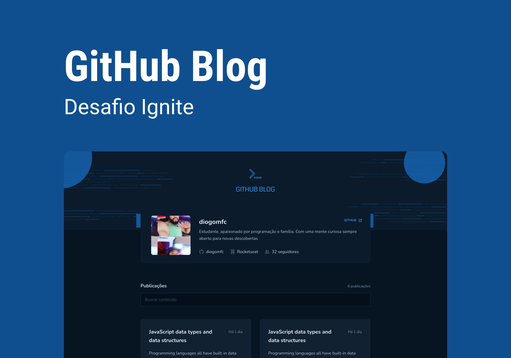

<h1 align="center">
  
</h1>
<p align="center">Aplicação para gerenciar um carrinho de compras </p>


<p align="center">
 <a href="#sobre-o-projeto">Sobre o Projeto</a> •
 <a href="#tecnologias">Tecnologias</a> •
 <a href="#configurações-necessárias">Configurações necessárias</a>
</p>

## Sobre o projeto

O projeto tem como objetivo o estudo e desenvolvimento de uma aplicação que utilizará da API do GitHub para buscar issues de um repositório, dados do seu perfil e exibir elas como um blog.

- Listagem do seu perfil com imagem, número de seguidores, nome e outras informações disponíveis pela API do GitHub.
- Listar e filtrar todas as issues do repositório com um pequeno resumo do conteúdo dela
- Criar uma página para exibir um post (issue) completo

O projeto foi desenvolvido como desafio das aulas do projeto 03 do [Ignite da Rocketseat](https://rocketseat.com.br/)

Link do [desafio](https://efficient-sloth-d85.notion.site/Desafio-03-Github-Blog-13593953670346908462ddc648d42cf1)

---

## Tecnologias

Abaixo as tecnologias utilizadas para construção da aplicação

- [ReactJS](https://reactjs.org/)
- [Vite](https://vitejs.dev/)
- [TypeScript](https://www.typescriptlang.org/)
- [styled-components](https://styled-components.com/)
- [Axios](https://axios-http.com/ptbr/docs/intro)
- [React Router Dom](https://reactrouter.com/en/main)


---

## Configurações necessárias

### **Requisitos**

Necessário realizar as instalações:

- [Git](https://git-scm.com/)
- [Yarn](https://classic.yarnpkg.com)

### **Clone do projeto**

```bash
# Execute o comando git clone para realizar o clone do repositório
$ git clone https://github.com/diogomfc/github-blog.git
# Entre na pasta do repositório clonado
$ cd github-blog
```

### **Iniciando o projeto**

```bash
# Execute yarn para instalar as dependências
$ yarn

# Para iniciar a aplicação
$ yarn dev

```
